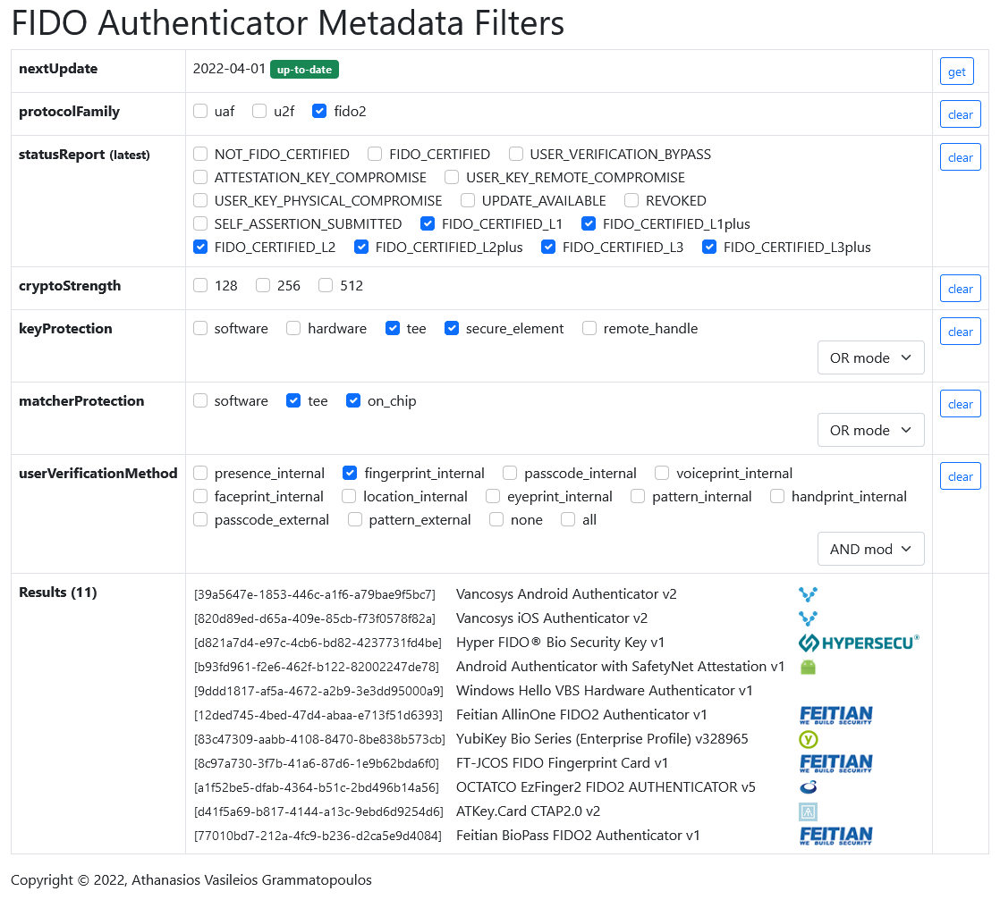
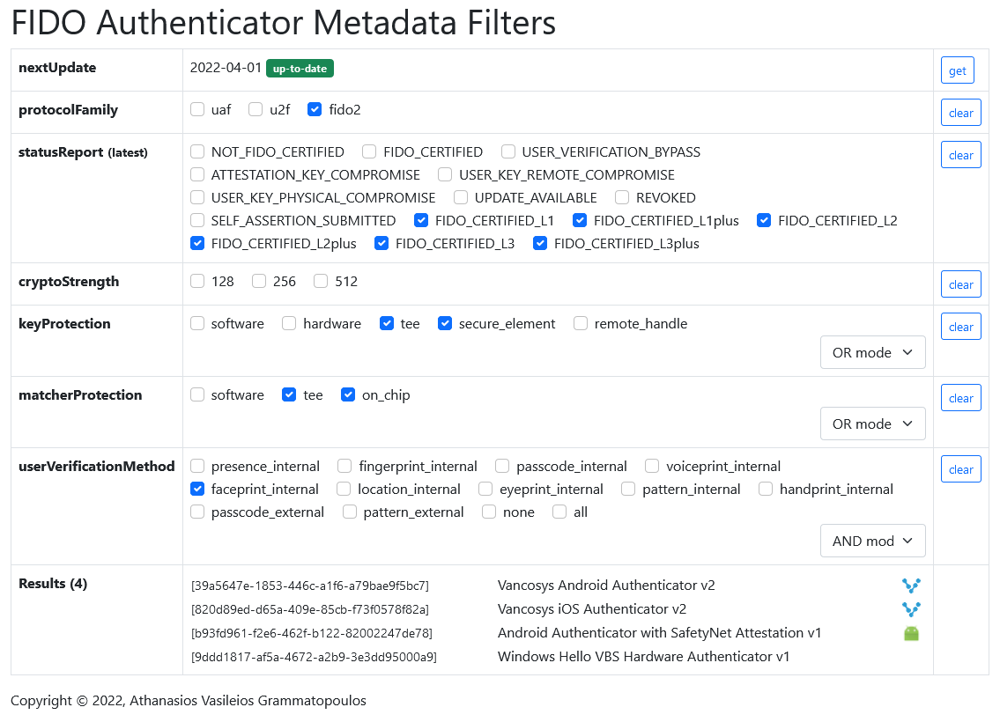

# FIDO-Authenticator-Metadata-Filters
A small web application to filter authenticator devices based on their metadata provided by the [FIDO Alliance Metadata Service](https://fidoalliance.org/metadata/).

The application loads and provides a UI to filter the authenticators based on their characteristics.

Web Application: https://gramthanos.github.io/FIDO-Authenticator-Metadata-Filters/

___

### Preview

Found 11 certified fido2 authenticator devices protected by hardware mechanics with fingerprint detection capabilities.

Found 4 certified fido2 authenticator devices protected by hardware mechanics with face detection capabilities.

___

### About
This small project was created in order to generate statistics regarding the availability of FIDO authenticator devices that cover specific requirments.

___

### Contact me

Contact me to leave me your feedback or to express your thoughts.

You can [open an issue](https://github.com/GramThanos/FIDO-Authenticator-Metadata-Filters/issues) or [send me a mail](mailto:gramthanos@gmail.com)

___

### License

This project is under [The MIT license](https://opensource.org/licenses/MIT).
I do although appreciate attribute.

Copyright (c) 2022 Grammatopoulos Athanasios-Vasileios

___

